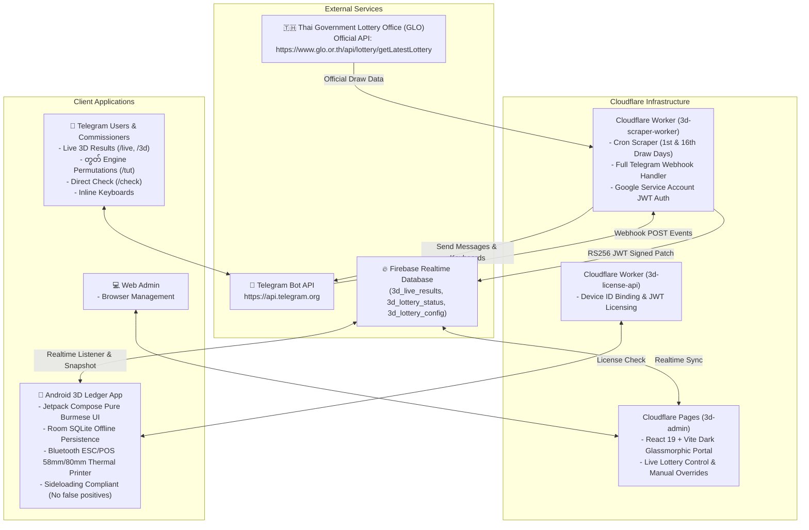

 # 3D Ledger System: Complete Infrastructure, Calculations & Operational Guide

> **Version**: 2.0.0 (Production Stable)  
> **Language Support**: Pure Myanmar Unicode (မြန်မာယူနီကုဒ်)  
> **Target Platforms**: Android (Offline-First Native), Cloudflare Workers (Serverless Scraper & Telegram Bot), Cloudflare Pages (React Admin Web Portal), Firebase Realtime Database.

---

## Table of Contents

1. [System Infrastructure & Architecture](#1-system-infrastructure--architecture)
   - [Architectural Overview Diagram](#architectural-overview-diagram)
   - [Subsystem 1: Android Client (`app/`)](#subsystem-1-android-client-app)
   - [Subsystem 2: Cloudflare Worker & GLO Scraper (`3d-scraper-worker/`)](#subsystem-2-cloudflare-worker--glo-scraper-3d-scraper-worker)
   - [Subsystem 3: Cloudflare Telegram Bot Engine (`telegramBot.ts`)](#subsystem-3-cloudflare-telegram-bot-engine-telegrambotts)
   - [Subsystem 4: Cloudflare Pages Admin Portal (`3d-admin/`)](#subsystem-4-cloudflare-pages-admin-portal-3d-admin)
   - [Subsystem 5: Licensing API (`3d-license-api/`)](#subsystem-5-licensing-api-3d-license-api)
2. [Mathematical Calculations & Financial Rules](#2-mathematical-calculations--financial-rules)
   - [Direct Winner (ပေါက်သီး / ဒဲ့) Rules](#direct-winner-ပေါက်သီး--ဒဲ့-rules)
   - [Unified တွတ် (Tut & ကပ်သီး) Calculation Engine](#unified-တွတ်-tut--ကပ်သီး-calculation-engine)
   - [Agent Commission & Settlement Matrix](#agent-commission--settlement-matrix)
   - [Financial Color Semantics](#financial-color-semantics)
   - [Overflow & Upper Agent Isolation (တင်ကွက် / လျှံကွက်)](#overflow--upper-agent-isolation-တင်ကွက်--လျှံကွက်)
   - [Real-World Calculation Scenarios (Verified by Automated Tests)](#real-world-calculation-scenarios-verified-by-automated-tests)
3. [Operational User Guide & Workflows](#3-operational-user-guide--workflows)
   - [Android App Daily Operations](#android-app-daily-operations)
   - [Telegram Bot Commands & Interactive Menu](#telegram-bot-commands--interactive-menu)
   - [Cloudflare Admin Web Portal Operations](#cloudflare-admin-web-portal-operations)
4. [Deployment, Testing & Maintenance](#4-deployment-testing--maintenance)
   - [Cloudflare Workers & Webhook Setup](#cloudflare-workers--webhook-setup)
   - [Android Build & Sideloading Instructions](#android-build--sideloading-instructions)
   - [Automated Test Suites](#automated-test-suites)

---

## 1. System Infrastructure & Architecture

### Architectural Overview Diagram



---

### Subsystem 1: Android Client (`app/`)
- **UI Framework**: Modern declarative Jetpack Compose UI adhering to strict Material 3 design standards.
- **Pure Burmese Typography**: All screens utilize pure Myanmar Unicode without mixing English loanwords (e.g. `ပေါက်သီး`, `တွတ်`, `ဒဲ့`, `ထွိုင်`, `ကော်မရှင်`, `ရရန်`, `ပေးရန်`).
- **Offline-First Storage**: Local Room SQLite database (`LotteryDatabase`) persists all agents, customers, batches, and bet tickets locally. Network connection is only required for syncing official results and license checks.
- **Input Engine**:
  - Custom Numpad with `ထွိုင်` (Permutation shortcut) positioned immediately next to `ဒဲ့`.
  - Advanced Paste Parser supporting free-text, voice-to-text transcriptions, and sequentially numbered exported vouchers (`1. 108 = 50`).
- **Thermal Printing**: High-speed ESC/POS driver supporting 58mm and 80mm Bluetooth thermal printers with Myanmar bitmap font rasterization.
- **Sideloading Safety**: Strict compliance with Google Play Protect guidelines; dangerous permissions such as `REQUEST_INSTALL_PACKAGES` have been removed to prevent false-positive security warnings during offline sideloading.

---

### Subsystem 2: Cloudflare Worker & Fast Live Scraper (`3d-scraper-worker/`)
- **Runtime**: Cloudflare Workers V8 serverless isolate.
- **Primary Domain**: `https://3d-scraper-worker.khaingkhantkyaw001.workers.dev`
- **Fast Real-Time Architecture (~3:15 PM MMT Delivery)**:
  - **Tier 1 (Fastest - ~3:15 PM MMT)**: Sanook Live News Scraper (`https://news.sanook.com/lotto/`). Thai reporters enter the 6-digit First Prize within seconds of the live TV draw ball dropping (~3:10 – 3:15 PM MMT), cutting the 15–30 minute delay of the official GLO government website.
  - **Tier 2 (Authoritative Archive - ~3:30 PM MMT)**: Official Government Lottery Office (GLO) of Thailand (`https://www.glo.or.th/api/lottery/getLatestLottery`). Used once official government certificates and PDFs are signed.
  - **Tier 3 (Mirror Fallback)**: Rayriffy Community Lottery API (`https://lotto.api.rayriffy.com/latest`).
- **Parsing Strategy**:
  - Extracts official 6-digit First Prize (`firstPrize`).
  - Thai 3D winning number is the **last 3 digits** of the First Prize (`threeD`).
  - Thai 2D winning number is extracted from 2-digit prize (`twoD`).
  - Target draw date and next draw date calculated according to the Thai lottery schedule (1st and 16th of each calendar month).
- **Firebase Authentication**: Generates RS256 JWT assertions using `GOOGLE_SERVICE_ACCOUNT_JSON` with SubtleCrypto, exchanging them for Google OAuth2 access tokens to patch the Realtime Database securely.
- **Automated Triggers**: Cron schedules configured in `wrangler.jsonc`:
  - `*/5 8-9 1,16 *`: High-frequency polling every 5 minutes during draw window (2:30 PM – 4:25 PM MMT) on draw days (1st & 16th).
  - `35 5 * * 1-5`: Morning market/lottery check.
  - `5 11 * * 1-5`: Afternoon session and draw close check.

---

### Subsystem 3: Cloudflare Telegram Bot Engine (`telegramBot.ts`)
- **Engine Location**: Embedded directly inside `3d-scraper-worker`.
- **Endpoints**:
  - `POST /webhook` & `POST /telegram`: Receives update events from Telegram webhook servers.
  - `GET /set-webhook`: One-click registration with Telegram API.
  - `GET /webhook-info`: Queries current webhook status and queue count.
  - `GET /test-telegram`: Sends test dispatch to configured `TELEGRAM_CHAT_ID`.
- **Token Flexibility**: Supports both raw token formats (`123456:ABC...`) and `bot`-prefixed strings, with automatic whitespace trimming.
- **Features**: Full Myanmar Unicode replies, inline interactive keyboards, automatic တွတ် generation, live check, batch inspection, and admin commands.

---

### Subsystem 4: Cloudflare Pages Admin Portal (`3d-admin/`)
- **Technology**: React 19, Vite, Lucide Icons, Glassmorphic CSS.
- **Live Local Port**: `http://localhost:5173`
- **Capabilities**:
  - Realtime dashboard showing active batch, declared winners, and total system sales.
  - Mode toggle: **Automatic Mode** (GLO Scraper controls results) vs **Manual Mode** (Admin manually inputs numbers).
  - Web-based တွတ် calculation engine (`tutLogic.js`).

---

### Subsystem 5: Licensing API (`3d-license-api/`)
- **Runtime**: Cloudflare Workers with KV/D1 storage.
- **Capabilities**: Device ID fingerprint validation, trial expiration dates, and activation key generation.

---

## 2. Mathematical Calculations & Financial Rules

### Direct Winner (ပေါက်သီး / ဒဲ့) Rules
- **Winning Condition**: Bet number matches the official 3-digit Thai lottery winning number exactly in digit and position.
- **Calculation Formula**:
  $$\text{Winning Payout (ဒဲ့)} = \text{Bet Amount} \times \text{Direct Multiplier (ဒဲ့အဆ)}$$
- **Example**:
  - Winning Number: `108`
  - Bet: `108` for `1,000 MMK` with Multiplier `600x`
  - Direct Payout: $1,000 \times 600 = 600,000\text{ MMK}$

---

### Unified တွတ် (Tut & ကပ်သီး) Calculation Engine

In the 3D Ledger system, **တွတ်** is a single unified payout category that comprises two distinct mathematical components:

1. **Permutations (ပတ်လည် / အလှည့်)**:
   - All unique anagram rearrangements of the 3 digits, excluding the direct winning number itself.
   - Distinct digits (e.g. `108`): 5 permutations $\rightarrow$ `180, 018, 081, 810, 801`.
   - Double repeating digits (e.g. `212`): 2 permutations $\rightarrow$ `122, 221`.
   - Triple repeating digits (e.g. `222`): 0 permutations.

2. **Near Numbers (ကပ်သီး / အတိုးအလျော့)**:
   - Numbers that differ from the winning number by exactly $\pm 1$.
   - Includes cyclic modular boundaries ($000 \leftrightarrow 999$):
     - `108` $\rightarrow$ `107` and `109`.
     - `000` $\rightarrow$ `999` and `001`.
     - `999` $\rightarrow$ `998` and `000`.

3. **Unified Tut Set**:
   $$\text{tutSet} = (\text{Permutations} \cup \text{NearNumbers}) \setminus \{\text{WinningNumber}\}$$
   Every number in this set is treated as a **တွတ်** winner.

4. **Tut Payout Formula**:
   $$\text{Winning Payout (တွတ်)} = \text{Bet Amount} \times \text{Tut Multiplier (တွတ်အဆ)}$$

---

### Agent Commission & Settlement Matrix

For every registered commissioner (ကော်မရှင်စား ကိုယ်စားလှယ်):

1. **Total Sales (စုစုပေါင်း ထိုးကြေး)**:
   $$\text{GrossBet} = \sum \text{Bets}$$

2. **Commission Discount (ကော်မရှင် / အထိမ်)**:
   $$\text{CommissionAmount} = \text{GrossBet} \times \left(\frac{\text{CommissionRate\%}}{100}\right)$$

3. **Net Due from Sales (ကော်မရှင်နုတ်ပြီး ထိုးကြေး)**:
   $$\text{NetBetDue} = \text{GrossBet} - \text{CommissionAmount}$$

4. **Total Payout to Agent (စုစုပေါင်း ပေါက်ကြေး)**:
   $$\text{TotalPayout} = \sum \text{DirectPayouts} + \sum \text{TutPayouts}$$

5. **Net Balance Settlement (အသားတင် ကျန်ငွေ)**:
   $$\text{NetBalance} = (\text{NetBetDue} + \text{PreviousDebt}) - \text{TotalPayout}$$

---

### Financial Color Semantics

To ensure intuitive bookkeeping and prevent accounting mistakes:

| Financial State | Meaning | Display Text | Color Code |
| :--- | :--- | :--- | :--- |
| **Net Balance $> 0$** | House receives money from agent | `ကျန်ငွေ (ရရန်)` | **Green** (`#059669` / `#69F0AE`) |
| **Net Balance $< 0$** | House owes payout money to agent | `ကျန်ငွေ (ပေးရန်)` | **Red** (`#DC2626` / `#FF5252`) |
| **Debt $> 0$** | Agent owes previous unpaid balance | `ကြွေးကျန် (ရရန်)` | **Green** (`#059669` / `#69F0AE`) |
| **Debt $< 0$** | House owes previous advance credit | `ကြွေးကျန် (ပေးရန်)` | **Red** (`#DC2626` / `#FF5252`) |

---

### Overflow & Upper Agent Isolation (တင်ကွက် / လျှံကွက်)

1. **Hot Number Limit (သတ်မှတ် အကန့်အသတ်)**:
   - When cumulative bets on a single number exceed the dealer's risk threshold, surplus bets are diverted to Overflow Vouchers.
2. **Strict Commissioner Isolation**:
   - Upper agents who receive overflow bets **NEVER** appear in the commissioner accounting list or customer list.
   - Vouchers are tagged with customer names containing `တင်ကွက်`, `overflow`, `upper`, or `အထက်ဒိုင်` and are strictly excluded by `LotteryDao.kt` and `CommissionerResultScreen.kt`.
3. **Sequential Numbering for Fast Forwarding**:
   - Exported overflow vouchers format lines as `1. 108 = 50`, `2. 245 = 100`.
   - The betting parser strips leading sequential numbers automatically, allowing direct copy-pasting across applications without manual cleanup.

---

### Real-World Calculation Scenarios (Verified by Automated Tests)

These exact scenarios are validated by automated unit tests in [`CalculationVerificationTest.kt`](file:///c:/Users/localhost/Downloads/3d_Agent/app/src/test/java/com/threeDLedger/CalculationVerificationTest.kt):

#### Scenario 1: Typical House Gain (Receivable / ရရန်)
- **Agent Settings**: Commission: `10%`, Direct Multiplier: `600x`, Tut Multiplier: `10x`, Previous Debt: `0 MMK`.
- **Winning Number**: `108`
- **Bets Placed**:
  - `108` (Direct) = `100 MMK`
  - `801` (Permutation Tut) = `200 MMK`
  - `109` (Near Tut) = `300 MMK`
  - `555` (Losing Bet) = `9,400 MMK`
- **Calculations**:
  - $\text{Gross Bet} = 100 + 200 + 300 + 9,400 = 10,000\text{ MMK}$
  - $\text{Commission} = 10,000 \times 10\% = 1,000\text{ MMK}$
  - $\text{Net Bet Due} = 10,000 - 1,000 = 9,000\text{ MMK}$
  - $\text{Direct Payout} = 100 \times 600 = 60,000\text{ MMK}$
  - $\text{Tut Payout} = (200 + 300) \times 10 = 5,000\text{ MMK}$
  - $\text{Total Payout} = 60,000 + 5,000 = 65,000\text{ MMK}$
  - $\text{Net Balance} = 9,000 - 65,000 = -56,000\text{ MMK}$ (House must pay agent `56,000 MMK` $\rightarrow$ **Red** `ကျန်ငွေ (ပေးရန်)`).

#### Scenario 2: Zero Winning Payout (House Full Win)
- **Gross Bet**: `10,000 MMK` (all losing numbers).
- $\text{Commission}: 10,000 \times 10\% = 1,000\text{ MMK}$.
- $\text{Net Bet Due}: 9,000\text{ MMK}$.
- $\text{Payout}: 0\text{ MMK}$.
- $\text{Net Balance}: 9,000 - 0 = +9,000\text{ MMK}$ (Agent must pay house `9,000 MMK` $\rightarrow$ **Green** `ကျန်ငွေ (ရရန်)`).

#### Scenario 3: Settlement with Prior Unpaid Debt
- $\text{Gross Bet}: 10,000\text{ MMK}$, Commission: `10%` $\rightarrow$ $\text{Net Bet Due} = 9,000\text{ MMK}$.
- $\text{Prior Debt}: +15,000\text{ MMK}$ (Agent owed house from last draw).
- $\text{Winning Payout}: 0\text{ MMK}$.
- $\text{Net Balance} = (9,000 + 15,000) - 0 = +24,000\text{ MMK}$ (Agent owes `24,000 MMK` $\rightarrow$ **Green** `ကျန်ငွေ (ရရန်)`).

#### Scenario 4: Boundary Near-Miss တွတ် (`000` & `999`)
- Winning Number: `000`
- Cyclic Near Numbers: `999` (decrement) and `001` (increment).
- Permutations: 0 (triple repeating digits).
- Payout: Bets on `999` and `001` receive full တွတ် payout (`10x`).

---

## 3. Operational User Guide & Workflows

### Android App Daily Operations

#### 1. Betting & Voucher Entry (ထိုးကြေး စာရင်းသွင်းခြင်း)
1. Open the **Betting Screen** (`ထိုးကြေး`).
2. Select the Customer / Commissioner name from the dropdown.
3. Use the on-screen Numpad or type directly:
   - **ဒဲ့ (Direct)**: Enter 3 digits and amount (e.g. `108 = 500`).
   - **ထွိုင် (All Permutations)**: Press `ထွိုင်` after entering 3 digits to bet on all unique anagrams automatically (e.g. `108 ထွိုင် 100` expands to all 6 permutations $\times 100 = 600\text{ MMK}$).
   - **ကပ်သီး (Near Numbers)**: Enter digits with `+` or `-` or use the quick shortcut.
   - **အကွက်ပြိုင် (Parallel Pairs)**: Type multiple numbers separated by dots or spaces.
4. **Pasting Long Vouchers**:
   - Copy text from Viber, Telegram, or Messenger.
   - Tap **စာသားဖြင့် ထည့်ရန် (Paste)** and press **အတည်ပြုမည်**.
   - Leading serial numbers (e.g. `1. `, `2) `) are parsed and stripped automatically.
5. Tap **စာရင်းသွင်းမည်** to save and optionally print via Bluetooth thermal printer.

#### 2. Live Numbers & Risk Ledger (အရောင်းစာရင်း နှင့် အကွက်ချုပ်)
- View the **Ledger Screen** (`စာရင်း`).
- **Before Declaration**:
  - Displays all 1,000 numbers (`000` to `999`) sorted by total bet amount.
  - Highlights numbers that exceed your risk limit in orange/red.
- **After Declaration**:
  - Non-winning numbers automatically collapse.
  - Only the direct winning number (`ပေါက်သီး`, Red) and တွတ် numbers (`တွတ်`, Orange) are displayed.
  - Bottom sticky under-bar displays Total Bets, Winning Bets, Winning Payouts, and Net Balance.

#### 3. Winner Declaration & Settlements (ပေါက်မဲကြေညာခြင်း နှင့် ရှင်းတမ်း)
1. Navigate to the **Winner Screen** (`ပေါက်သီး`).
2. Tap **တိုက်ရိုက်ရယူမည်** to fetch the official Thai GLO winning number immediately via the Cloudflare Worker API.
3. Or type the 3-digit number manually and tap **ပေါက်မဲ သတ်မှတ်မည်**.
4. Open the **Commissioners Screen** (`ကိုယ်စားလှယ်များ`):
   - All registered agents remain visible.
   - Agents are ranked from highest payout to lowest.
   - Tap any agent card to see the full itemized breakdown (Gross, Commission, Net Due, Direct Wins, Tut Wins, Prior Debt, Net Due).
   - Tap **ရှင်းတမ်း ပရင့်ထုတ်မည်** to print the final settlement slip for that agent.

#### 4. Overflow Voucher Forwarding (တင်ကွက် ပို့ဆောင်ခြင်း)
1. In the **Overflow Screen** (`တင်ကွက်`), review numbers exceeding limits.
2. Tap **ဘောင်ချာ ထုတ်ယူမည် (Export Voucher)**.
3. The app generates a formatted, clean voucher:
   ```text
   3D တင်ကွက် ဘောင်ချာ
   ဘောင်ချာအမှတ်: #V-1024
   ရက်စွဲ: 2026-09-17 16:35:00
   အပတ်စဉ်: 15
   --------------------------------
   1. 108 = 500
   2. 801 = 200
   3. 245 = 1000
   --------------------------------
   စုစုပေါင်း: 1,700 ကျပ်
   ```
4. Copy and forward directly to the upper dealer.

---

### Telegram Bot: 100% Button-Driven Architecture & Operations

The Telegram Bot provides a **100% button-driven user experience**. Users never need to type slash commands; every workflow is accessible via **Persistent Bottom Reply Keyboards** and **Contextual Inline Menus**. Slash commands remain available purely as optional backward-compatible shortcuts.

```text
┌────────────────────────────────────────────────────────────┐
│                    3D LEDGER TELEGRAM BOT                  │
├────────────────────────────────────────────────────────────┤
│  📊 ပင်မ ဒက်ရှ်ဘုတ်            │  ➕ ကုတ်အသစ် ထုတ်မည်      │
├────────────────────────────────┼───────────────────────────┤
│  👥 ကိုယ်စားလှယ်များ          │  💳 ငွေလက်ခံ အကောင့်များ   │
├────────────────────────────────┼───────────────────────────┤
│  👮‍♂️ Admin များ               │  💵 ကော်မရှင် သတ်မှတ်ချက်  │
├────────────────────────────────┼───────────────────────────┤
│  🏷️ အရောင်း စီမံချက်များ        │  📋 အသုံးပြုမှု စောင့်ကြည့်  │
├────────────────────────────────┼───────────────────────────┤
│  🎯 ပေါက်မဲ                    │  🇹🇭 3D Live ရလဒ်          │
└────────────────────────────────┴───────────────────────────┘
```

#### Role-Based Persistent Bottom Keyboards (`ReplyKeyboardMarkup`)

| Role | Keyboard Buttons | Action Triggered on Tap |
| :--- | :--- | :--- |
| **Admin** | `[📊 ပင်မ ဒက်ရှ်ဘုတ်]` | Opens Admin Main Dashboard with real-time stats |
| | `[➕ ကုတ်အသစ် ထုတ်မည်]` | Opens 1-Click Key Gen Menu with 1, 5, 10 key chips |
| | `[👥 ကိုယ်စားလှယ်များ]` | Lists resellers with Due balances, settlement & remove buttons |
| | `[💳 ငွေလက်ခံ အကောင့်များ]` | Displays Wave/KPay accounts with edit buttons |
| | `[👮‍♂️ Admin များ]` | Lists system admins with remove/add buttons |
| | `[💵 ကော်မရှင် သတ်မှတ်ချက်]` | Displays commission rates with preset edit buttons |
| | `[🏷️ အရောင်း စီမံချက်များ]` | Displays 1-Year, Lifetime, Trial plans & price edit buttons |
| | `[📋 အသုံးပြုမှု စောင့်ကြည့်]` | Displays active, claimed, and pending CD-keys |
| | `[🎯 ပေါက်မဲ]` | Opens Winner Declaration (Thai GLO / Manual) |
| | `[🇹🇭 3D Live ရလဒ်]` | Fetches live official Thai GLO 3D, 2D, and 1st prize |
| **Reseller** | `[💼 ဒက်ရှ်ဘုတ်]` | Shows total generated, activated, commission, and due balances |
| | `[➕ ကုတ်အသစ် ထုတ်မည်]` | Opens 1-click single generation menu |
| | `[🎁 ၃ ရက် Trial]` | Generates 1 3-day trial key immediately |
| | `[📅 ၁ နှစ် လိုင်စင်]` | Generates 1 1-Year (Device Changeable) key immediately |
| | `[💎 တစ်သက်တာ လိုင်စင်]` | Generates 1 Lifetime (1-Device) key immediately |
| | `[📦 အများပြား ထုတ်မည် (Bulk)]`| Opens bulk chips menu (5, 10 keys per plan) |
| | `[🇹🇭 3D Live ရလဒ်]` | Fetches live official Thai GLO results |
| **Direct Buyer** | `[🎁 ၃ ရက် အခမဲ့ စမ်းသပ်ခွင့်]` | Automatically claims/displays 72-hour free trial CD-Key |
| | `[🛒 လိုင်စင် ဝယ်ယူမည်]` | Displays 1-Year and Lifetime purchase cards with payment details |
| | `[🇹🇭 3D Live ရလဒ်]` | Fetches official Thai GLO draw results |
| | `[🔢 တွတ် ဂဏန်းများ]` | Displays interactive sample buttons (`108 တွတ်`, `212 တွတ်`, etc.) |
| | `[🎯 ပေါက်မဲ စစ်မည်]` | Checks winning numbers and displays guidelines |
| | `[❓ အကူအညီ]` | Displays app user guide and payment instructions |

#### Interactive Inline Button Workflows (`InlineKeyboardMarkup`)

1. **1-Click Single & Bulk Key Generation Chips**:
   - `gen_b:<planId>:<count>`: Admin taps `[📅 ၁ နှစ် (၅ ခု)]` or `[💎 တစ်သက်တာ (၁၀ ခု)]` to instantly generate and copy bulk CD-keys.
   - `r_gen_b:<planId>:<count>`: Reseller taps `[📅 ၁ နှစ် (၅ ခု)]` or `[💎 တစ်သက်တာ (၁၀ ခု)]` for 1-click instant reseller stock generation.
2. **Reseller Due Settlement Presets**:
   - Admin taps `[💵 ကိုစိုး ငွေရှင်းမည်]` $\rightarrow$ Bot presents quick settlement chips: `[💰 အပြည့်ရှင်းမည်]`, `[💵 50,000 Ks]`, `[💵 100,000 Ks]`, `[💵 200,000 Ks]`, `[💵 500,000 Ks]`.
   - Tapping any chip immediately credits the payment, reduces due balance, records the transaction in `reseller_ledger`, and alerts the reseller.
3. **No-Command Administrative Onboarding (`AdminState`)**:
   - Tapping `[➕ ကိုယ်စားလှယ် အသစ် ထည့်မည်]` sets interactive session $\rightarrow$ Admin simply replies `987654321 ကိုစိုး`.
   - Tapping `[➕ Admin အသစ် ထည့်မည်]` $\rightarrow$ Admin simply replies `123456789 ဦးအောင်`.
   - Tapping `[✏️ Wave Pay ပြင်ဆင်မည်]` or `[✏️ KBZPay ပြင်ဆင်မည်]` $\rightarrow$ Admin simply replies `09778899001 ဦးအောင်ကို`.
   - Any prompt can be cancelled with `[❌ မလုပ်တော့ပါ (Cancel)]`.
4. **Interactive Commission Presets**:
   - Lifetime Commission: `[3,000 Ks]`, `[5,000 Ks]`, `[7,000 Ks]`, `[10,000 Ks]`.
   - 1-Year Commission: `[5,000 Ks]`, `[10,000 Ks]`, `[15,000 Ks]`, `[20,000 Ks]`, `[25,000 Ks]`, `[30,000 Ks]`.
5. **Lottery Winner Declaration & Batch Toggles**:
   - `[🇹🇭 Thai GLO ရလဒ် အလိုအလျောက် သတ်မှတ်မည်]`: 1-click fetch from GLO API, calculating all တွတ် permutations and updating Firebase.
   - `[✏️ ဂဏန်း ကိုယ်တိုင် သတ်မှတ်မည်]`: Interactive prompt for manual 3-digit override.
   - `[➕ အကြိမ် +1 တိုးမည်]`, `[➖ အကြိမ် -1 လျှော့မည်]`: 1-click lottery batch switcher.

#### Command Shortcuts (Optional Backward Compatibility)

| Command | Role | Description |
| :--- | :--- | :--- |
| `/start` | All | Initializes role-tailored persistent bottom keyboard & main card |
| `/live`, `/3d`, `/result` | All | Fetches latest Thai GLO First Prize, 3D, and 2D |
| `/tut [number]` | All | Calculates တွတ် (permutations + near $\pm 1$) for any 3-digit number |
| `/check [number]` | All | Checks if number is a direct winner or a တွတ် winner |
| `/admin`, `/menu` | Admin | Launches Admin Main Dashboard |
| `/reseller` | Reseller | Launches Reseller Dashboard |
| `/gen [plan] [count]` | Admin/Reseller | Generates keys via command line |
| `/setwinner [number]` | Admin | Declares manual winning number |
| `/setbatch [number]` | Admin | Sets active batch number |

#### Direct Buyer Checkout & In-Bot Screenshot Verification

1. **Buyer Selects Plan**: Buyer clicks `[🛒 ၁ နှစ် လိုင်စင် ဝယ်ယူမည်]` (180,000 MMK) or `[🛒 တစ်သက်တာ လိုင်စင် ဝယ်ယူမည်]` (45,000 MMK).
2. **Payment Accounts Displayed**: Bot displays Admin's configured Wave Pay and KBZPay account numbers and names.
3. **Screenshot Upload**: Buyer transfers funds and sends payment screenshot (`photo`) to the Telegram bot.
4. **Admin Broadcast & Inline Approval**: Bot creates `BuyerOrder` (`status: pending`) and sends screenshot with caption to all Admins with `[✅ အတည်ပြုပြီး ကုတ်ထုတ်ပေးမည်]` and `[❌ ငြင်းပယ်မည်]`.
5. **Instant Key Delivery**: Upon Admin approval, CD-Key is auto-generated and sent directly to buyer's Telegram chat.
6. **Device Activation & Polling**: Buyer inputs CD-Key into Android app. If manual approval is active, Android app displays "ခွင့်ပြုချက် စောင့်ဆိုင်းနေပါသည်" (Waiting for Admin approval) and polls `/check-status` every 3 seconds until approved by Admin or the generating Reseller.
7. **Reseller Due & Commission Accounting**: If key was generated by a reseller:
   - Commission is credited to reseller (`5,000 MMK` for Lifetime, `10,000 MMK` for 1-Year).
   - Due balance is added: `Due = Plan Price - Commission`.
   - Admin settles due via `/payreseller <id> <amount|full>`.

---

### Cloudflare Admin Web Portal Operations (`3d-admin/`)

1. Open `http://localhost:5173` (or the deployed Cloudflare Pages URL).
2. Enter the administrator credentials.
3. **Live Overview**: Inspect real-time gross betting volume, total keys, available keys, claimed keys, and active batch.
4. **Official Thai GLO Lottery Live Scraper & 1-Click Sync**:
   - **Auto-polling**: Cloudflare Pages automatically polls official Thai GLO lottery results on load and every 60 seconds.
   - **Live Data Displayed**: Displays 1st Prize (รางวัลที่ 1, e.g. `730640`), Official 3D Winning Number (`640`), 2D (`64`), and Draw Date (`2026-09-16`).
   - **Live Sync Indicator**: Compares the official GLO 3D number with the active Firebase winning number:
     - `🟢 IN SYNC`: Live Android App is currently displaying the official GLO winning number.
     - `⚠️ OUT OF SYNC`: Live Android App differs from the official GLO winning number.
   - **1-Click ⚡ Apply GLO Result to Live App & Telegram**: Instantly commits the official GLO result to Firebase RTDB (`3d_live_results` and `3d_lottery_status`), automatically calculates တွတ် (permutations & cyclic near-misses), sets state to `declared`, and pushes live updates to all Android devices and Telegram bots.
5. **Strictly 3 Synchronized Sale Plans**:
   - Both Telegram Bot and Cloudflare Pages share strictly the **3 official plans**:
     1. **3-Day Free Trial (`trial_3d`)**: 0 MMK, exactly 72 hours.
     2. **1-Year Plan (`one_year`)**: 180,000 MMK, 365 days.
     3. **Lifetime Plan (`lifetime`)**: 45,000 MMK, perpetual (တစ်သက်တာ).
   - Admins can update plan prices in the web portal with 1 click, instantly syncing with Firebase and the Telegram bot. Custom durations have been deprecated in favor of these 3 clean, predictable plans.
6. **Bulk CD-Key Generator with Per-Plan Device Switching Mode**:
   - **Plan Selection**: Select from 3-Day Trial, 1-Year, or Lifetime.
   - **Per-Plan Device Switching Mode Toggle**:
     - `[ 🔄 ON · စက်ပြောင်းခွင့် ပြုမည် ]`: Key allows switching to a new device; the old device is automatically revoked and remaining subscription days transfer seamlessly to the new device.
     - `[ 🔒 OFF · ဖုန်း ၁ လုံးတည်း သီးသန့် ]`: Key binds exclusively to the first activated device and cannot be transferred.
     - Admins can toggle Device Switching Mode ON or OFF freely for *any* plan (Trial, 1-Year, or Lifetime) prior to generation.
   - **Bulk Generation Quantity**: Preset chips (`1`, `5`, `10`, `25`, `50`, `100` keys) plus direct numeric input (up to 100 keys per batch).
   - **Atomic Generation & .TXT Export**:
     - Keys are generated and committed to Firebase atomically in a single transaction.
     - **📋 Copy All Keys**: 1-click clipboard copy of all generated keys formatted one per line.
     - **💾 Download .TXT**: Instant file download (`3d_keys_{plan}_{mode}_{count}keys_{date}.txt`) for convenient customer distribution.
7. **License Keys Table & Advanced Filtering**:
   - Displays CD-Key, Plan/Duration, Device Mode badge (`🔄 Changeable` vs `🔒 1 Device`), Status (`🟢 Available`, `🔴 Claimed/Active`, `⚪ Revoked`), Active Device Model/ID (with migration history indicator), and Date.
   - Filters by: All Keys, Available, Claimed/Active, Device Changeable, 1-Device Only, 3-Day Trial, 1-Year, Lifetime, and Revoked.
8. **Lottery Mode Switch & Manual Override**:
   - **Automatic Mode**: Thai GLO Scraper Worker runs on schedule and updates the winning number upon official draw completion.
   - **Manual Mode**: Scraper skips automated overwrites, allowing the dealer to control declaration timing.
   - **Instant Manual Override**: Push any 3-digit number to all connected Android devices with customizable status (`waiting`, `pending`, `declared`, `delayed`).

---

## 4. Deployment, Testing & Maintenance

### Cloudflare Workers & Webhook Setup

#### 1. Worker Deployment
```powershell
cd 3d-scraper-worker
npx wrangler deploy
```
- Deploys the worker to `https://3d-scraper-worker.khaingkhantkyaw001.workers.dev`.

#### 2. Telegram Webhook Registration
To link the Telegram Bot API to the Cloudflare Worker webhook:
```powershell
curl.exe -s "https://3d-scraper-worker.khaingkhantkyaw001.workers.dev/set-webhook"
```
Response:
```json
{
  "status": "ok",
  "webhookUrl": "https://3d-scraper-worker.khaingkhantkyaw001.workers.dev/webhook",
  "telegram": {
    "ok": true,
    "result": true,
    "description": "Webhook was set"
  }
}
```

#### 3. Webhook Status Verification
```powershell
curl.exe -s "https://3d-scraper-worker.khaingkhantkyaw001.workers.dev/webhook-info"
```

---

### Android Build & Sideloading Instructions

To compile a clean APK ready for sideloading on any Android device:
```powershell
.\gradlew.bat assembleDebug
```
- **Binary Output**: `app\build\outputs\apk\debug\app-debug.apk` (~24 MB).
- **Sideloading**: Copy `app-debug.apk` directly to Android devices via USB, Telegram, or Google Drive and install. No Google Play Protect blockages will occur.

---

### Automated Test Suites

The entire system is guarded by multi-layered automated test suites:

| Subsystem | Test Command | Scope |
| :--- | :--- | :--- |
| **Android Calculations** | `.\gradlew.bat testDebugUnitTest` | Validates all 5 real settlement scenarios, တွတ် sets, and numbered voucher parsing. |
| **Android Compose UI** | `.\gradlew.bat testDebugUnitTest` | Validates `ထွိုင်` button interactions and green/red financial indicators. |
| **Cloudflare Worker** | `npm test` in `3d-scraper-worker/` | Validates GLO parser, Telegram `/start`, `/tut`, and inline callbacks. |
| **Cloudflare Web Admin** | `node --test` in `3d-admin/` | Validates တွတ် calculation permutations and boundary cyclic behavior. |

---

*This document is maintained as the authoritative system specification for the 3D Ledger platform.*
