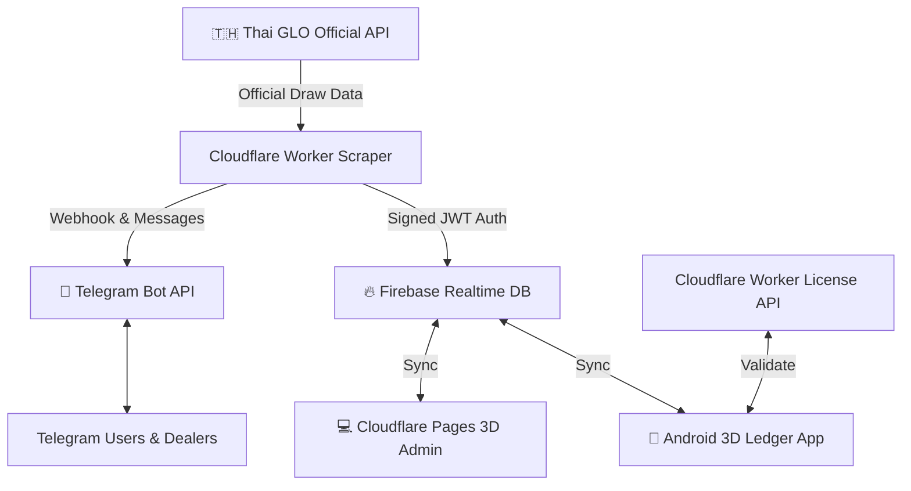

# 3D Ledger: Native Android App, Cloudflare Scraper, Telegram Bot & Web Admin

[](https://3d-scraper-worker.khaingkhantkyaw001.workers.dev)
[](https://github.com/sayarkhant001/3d_Agent)
[](https://firebase.google.com)
[]()

Complete, production-ready enterprise 3D Lottery Ledger platform tailored for the Myanmar market with official Thai Government Lottery (GLO) scraper integration, native Android client with Bluetooth thermal printing, full Telegram bot on Cloudflare Workers, and dark glassmorphic Cloudflare Pages web portal.

📖 **For exhaustive technical calculations and complete operational workflows, see [DOCUMENTATION.md](DOCUMENTATION.md).**

---

## 🌟 Key Features

- **Official Thai GLO Scraper**: Directly fetches 3D and 2D winning numbers from the official Thai Government Lottery Office (`https://www.glo.or.th/api/lottery/getLatestLottery`).
- **Full Telegram Bot on Cloudflare Workers**:
  - Webhook-driven serverless bot deployed at `https://3d-scraper-worker.khaingkhantkyaw001.workers.dev`.
  - Commands: `/start`, `/live`, `/3d`, `/result`, `/tut [num]`, `/check <num>`, `/status`, `/batch`.
  - Protected admin controls: `/setbatch <num>`, `/setwinner <num>`.
  - Interactive Burmese inline keyboards.
- **Native Android App (`app/`)**:
  - Pure Myanmar Unicode typography across all screens.
  - Custom Numpad with `ထွိုင်` (Permutation shortcut) next to `ဒဲ့`.
  - Offline-first Room SQLite storage with real-time Firebase sync.
  - ESC/POS 58mm & 80mm Bluetooth thermal printer support.
  - Sideloading compliant: Cleaned permissions to prevent Google Play Protect false positives.
- **Unified တွတ် (Tut & ကပ်သီး) Engine**:
  - Automatically combines permutations (up to 5) and near numbers ($\pm 1$) into a single unified payout category.
- **Financial Color Semantics**:
  - **Green** (`#059669` / `#69F0AE`): Amounts to receive (ရရန် / Gain).
  - **Red** (`#DC2626` / `#FF5252`): Amounts to pay out (ပေးရန် / Loss).
- **Overflow Voucher Forwarding (တင်ကွက် / လျှံကွက်)**:
  - Hot-number limits with sequential numbering (`1. 108 = 50`) for easy copying and pasting into upper agent chats.
  - Complete isolation: Upper agents never appear in commissioner ledgers.

---

## 🏛️ System Architecture



---

## 📂 Project Structure

```text
3d_Agent/
├── app/                          # Native Android App (Kotlin + Jetpack Compose)
│   ├── src/main/java/com/threeDLedger/
│   │   ├── data/                 # Room Database, DAOs, Entities, Models
│   │   ├── ui/                   # Jetpack Compose Screens (Betting, Ledger, Winner, etc.)
│   │   └── printer/              # ESC/POS Bluetooth Thermal Printing Driver
│   └── src/test/java/            # Unit & Robolectric Compose UI Tests
├── 3d-scraper-worker/            # Cloudflare Worker (Thai GLO Scraper & Telegram Bot)
│   ├── src/index.ts              # Scraper cron handler & Webhook routing
│   ├── src/telegramBot.ts        # Telegram bot engine & Burmese UI
│   └── test/index.spec.ts        # Vitest automated worker tests
├── 3d-admin/                     # Cloudflare Pages Admin Portal (React 19 + Vite)
│   ├── src/App.jsx               # Dark glassmorphic admin dashboard
│   ├── src/tutLogic.js           # Web-based တွတ် calculation engine
│   └── test/tutLogic.test.js     # Tut calculation unit tests
├── 3d-license-api/               # Cloudflare Worker Device Licensing API
├── DOCUMENTATION.md              # Exhaustive calculation specs and operational guide
└── README.md                     # Project overview and quick start
```

---

## 🚀 Quick Start

### 1. Android Application

#### Prerequisites
- Android Studio Ladybug or newer
- JDK 17+
- Android device or emulator running Android 8.0+ (API 26+)

#### Build APK
```powershell
.\gradlew.bat assembleDebug
```
Output binary: `app/build/outputs/apk/debug/app-debug.apk` (~24 MB).

#### Run Tests
```powershell
.\gradlew.bat testDebugUnitTest
```

---

### 2. Cloudflare Worker (GLO Scraper & Telegram Bot)

#### Prerequisites
- Node.js 20+
- Wrangler CLI (`npm install -g wrangler`)
- Cloudflare Account authenticated (`npx wrangler whoami`)

#### Run Tests
```powershell
cd 3d-scraper-worker
npm test
```

#### Deploy to Cloudflare
```powershell
npx wrangler deploy
```

#### Set Telegram Webhook
```powershell
curl.exe -s "https://3d-scraper-worker.khaingkhantkyaw001.workers.dev/set-webhook"
```

---

### 3. Cloudflare Pages Admin Portal

```powershell
cd 3d-admin
npm install
npm run dev
```
Preview at `http://localhost:5173`.

---

## 📊 Summary of Financial Formulas

| Metric | Formula | Semantics |
| :--- | :--- | :--- |
| **Gross Bet** | $\sum \text{Bets}$ | Total volume wagered |
| **Commission** | $\text{Gross Bet} \times (\text{Rate\%} / 100)$ | Agent discount / rebate |
| **Net Bet Due** | $\text{Gross Bet} - \text{Commission}$ | Total sales after discount |
| **Direct Win Payout** | $\text{Bet} \times \text{Direct Mult}$ | Payout for exact 3-digit match |
| **Tut Win Payout** | $\text{Bet} \times \text{Tut Mult}$ | Payout for permutation or near match ($\pm 1$) |
| **Net Balance** | $(\text{Net Bet Due} + \text{Debt}) - \text{Total Payout}$ | Positive: **Green** (ရရန်)<br/>Negative: **Red** (ပေးရန်) |

---

## 📄 Documentation Links

- [**Full System Infrastructure & Calculation Specification (DOCUMENTATION.md)**](DOCUMENTATION.md)
- [**Application User Guide & Verification Proof (app_user_guide_and_calculation_spec.md)**](app_user_guide_and_calculation_spec.md)
- [**Implementation Walkthrough & Deployment Proof (walkthrough.md)**](walkthrough.md)

---

## ⚖️ License

Proprietary and Confidential. All rights reserved.
